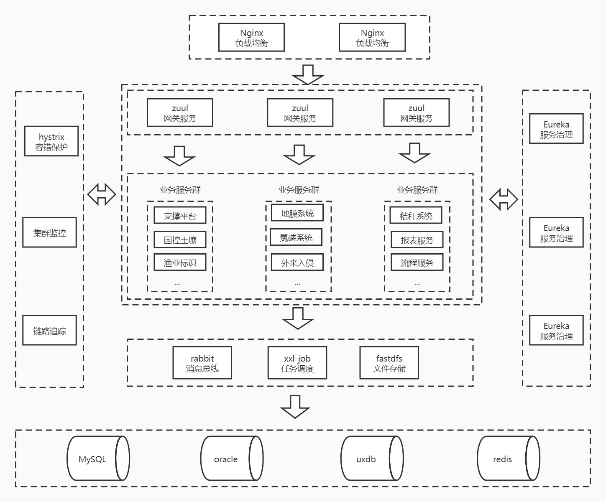

# 1. 生态系统架构图

# 2. 主要服务介绍
 * sofn-common 公共库
 * sys-service 应用支撑平台
 * gateway-service 网关服务
 * register-service 注册中心
 * share-service 信息资源目录
 * xxl-job 任务调度服务
 * report-service 报表服务
 * flow_code/workflow-service 工作流服务
 * ...
 
# 3. 权限认证
## 3.1 认证方式
 shiro拦截认证 + jwt生成token
 
## 3.2 认证逻辑
 * 第一层：网关，验证token的合法性
 * 第二层：shiro，每次请求会在服务中的shiro拦截器中验证token合法性和用户权限

## 3.3 接口放行
 在sofn-common公共库中的src/main/resources/config/application-filter.yml中配置放行路径
 
# 4. 日志管理
## 4.1 收集查看
 * 日志使用FELK（FileBeat，ElasticSearch, Logstash， Kibana）的方式收集查看
 * FileBeat用来收集日志，如果使用docker部署，已经将FileBeat制作成了docker镜像，镜像相关文件在sys-service/src/main/evn/docker下；
 打包应用镜像时依赖FileBeat镜像就行了，具体配置可以参考sys-service/pom.xml下的docker-maven-plugin插件配置
 * Logstash用来处理日志
 * ElasticSearch用来存储日志
 * Kibana提供可视化日志查询界面
 
# 工作流
 * 工作流使用业主采购的中创工作流中间件
 * 服务名为flow_code/workflow-service
 
# 智能表单
* 智能表单使用了帆软的报表组件
* 项目中有一个嵌入式集成服务report-service，也可以独立部署
 
# 文件服务器
* 采用了开源的fastDFS，支撑平台中提供了相应的文件操作方法，业务系统直接调用支撑平台api